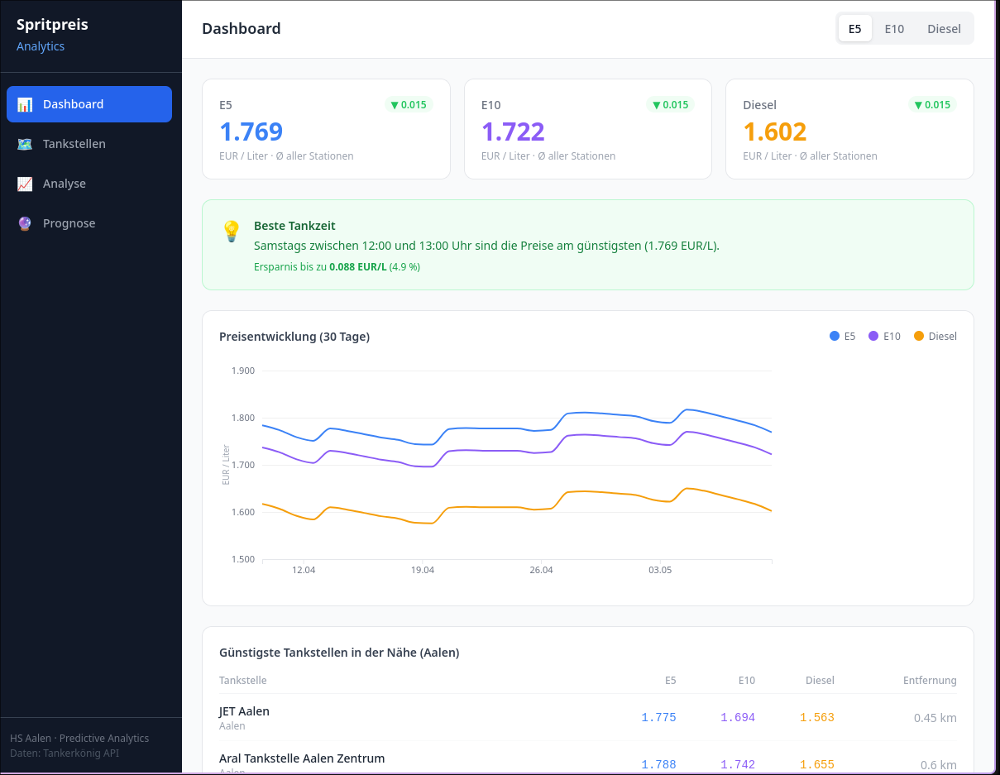
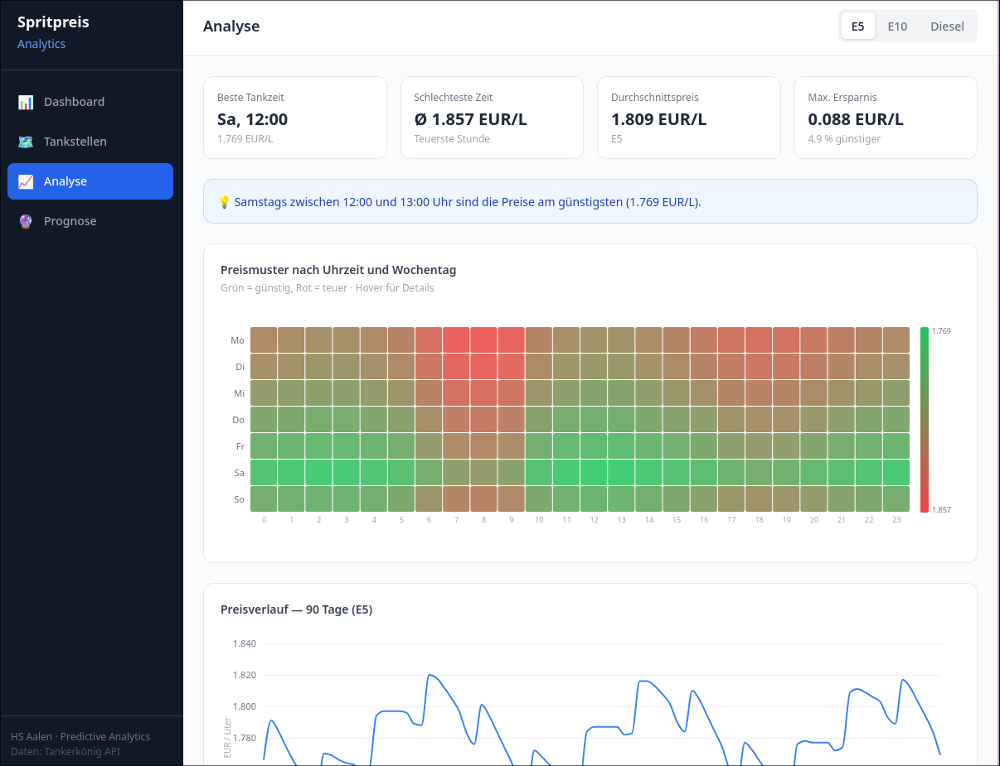
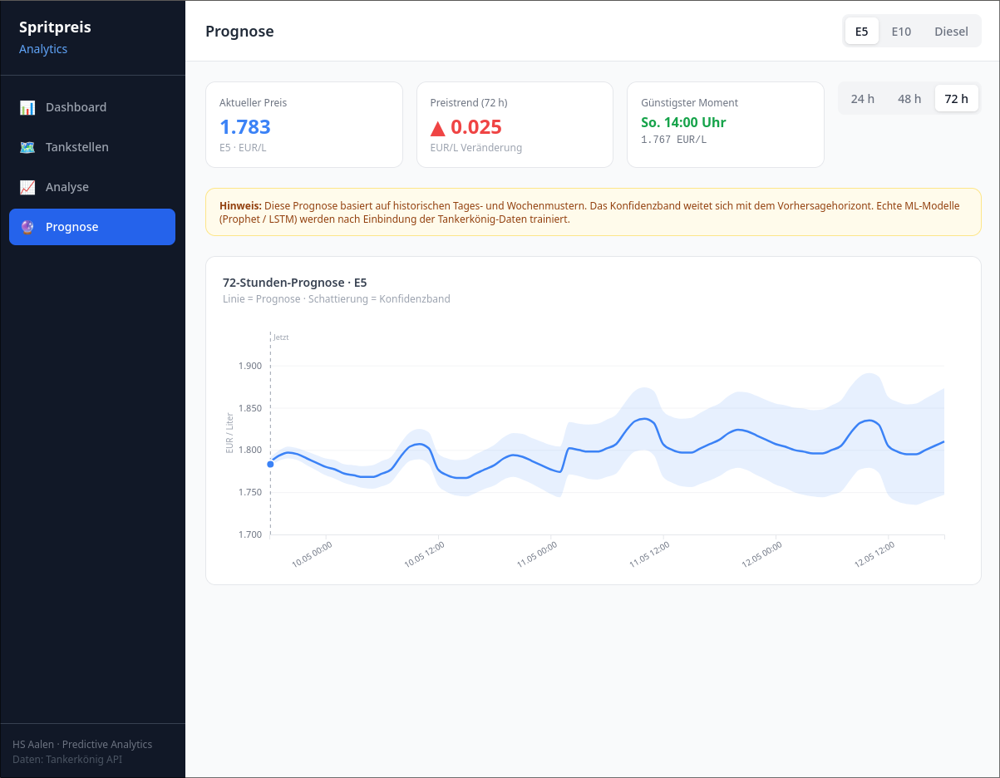

# Spritpreisvorhersage

## Motivation


## Business-Kontext
Ein Spediteur möchte den optimalen Zeitpunkt für das Betanken seiner LKW-Flotte finden. 
Das Unternehmen besitzt 25 LKWs. 
Ein LKW hat einen durchschnittlichen Verbrauch von 30 Litern / 100 km und eine Fahrleistung je Fahrzeug von 500 km / Tag. 
In einem Tag verbraucht die Flotte somit rund 3750 Liter Diesel. 
Preiserhöhungen von wenigen Cent am Tag können so bereits zu dreistelligen Verlusten führen.

\* Zahlen sind typische Durchschnittswerte
## Ziel
Vorhersage von Spritpreisen in € als Regressionsproblem.

⚠️🚧🚧⚠️ Welche Vorhersage? also: nächster Zeitpunkt (t + 1h ?), Tagesdurchschnitt?, Minimum im nächsten Zeitraum (und wenn ja: in welchem?)

> Was meinst du hiermit? 
> Ich fände dabei die variabilität Inhaltlich. Er hat ja auch gesagt wir sollen die Daten interaktiv gestalten. Sprich wir können genau die faktoren ja mal grafisch aufbereiten. Können wir ja hier im Dokument mal gemeinsam aufzählen

>> gute Idee aber das verkompliziert die Sache vermutlich. Das Problem: wir müssen den MLP-Regressor dann so bauen, dass er drei Output-Neuronen hat, also +1h , +3h + 6h oder sowas ([s.u.](#modellierungsansatz)).
Und: Wenn ich der Spediteur bin: Warum sollte ich den Horizont wählen wollen? Ich will doch nur wissen: Wann in den nächsten 24 Stunden ist es am billigsten? Wäre es nicht sinnvoller das Modell so zu bauen, dass es immer die nächsten 24 Stunden als Kurve vorhersagt, anstatt den Nutzer raten zu lassen, welcher Horizont gerade wichtig ist?


⚠️🚧🚧⚠️ Noch zu klären: "Vorhersage von Spritpreisen" vs. "Optimaler Tankzeitpunkt". Das ist nicht das gleiche! 

> Ja das stimmt. Optimaler Tankzeitpunkt beinhaltet aber Vorhersage der nächsten Tankzeitpunkte. inklusive zukünftigem KonfidenzIntervall. 
> Falls du Docker kannst, kannst du gerne mal in dem kopierten repo mal 
> ```docker compose up``` ausführen. Manchmal ist das auch ```docker-commpose up```
> In den bisherig erstellten Inhalten unten, sind bereits genau solche Visualisierungen enthalten. 
> Hier bei finde ich gerade die Heatmap sehr angenehm für Erwartungsverhalten. Dabei kann der/die NutzerIn nicht nur unsere vorhersage betrachten sondern auch eigene schlüsse aus bisherigem Preisverhalten selbst ziehen. Siehe [Heatmap](#bisher-erstellte-inhalte)


## Gewählter ML-Ansatz
Als Hauptansatz wurde ein **MLP-Regressor** gewählt.
- Laut Dozent erlaubt und mit dem Modul Predictive Analytics vereinbar
- geeignet für **nichtlineare Zusammenhänge**
- passend für **tabellarische Daten mit Feature Engineering**

## Feature Auswahl
- **Lag-Features** (\*Hinweis s.u.)
    - Preis vor 1 Stunde
    - Preis vor 3 Stunden
    - Preis vor 24 Stunden
- **Rolling Features**
    - gleitender Mittelwert über 6 Stunden
    - gleitender Mittelwert über 24 Stunden
- **Kalender-/Zeitmerkmale**
    - Stunde des Tages
    - Wochentag
- **optional externe Variable**
    - Rohölpreis / Brent-Preis

\* Hinweis: Das Modell ist **kein natives Zeitreihenmodell**.  
Daher muss die zeitliche Struktur **explizit über Features** abgebildet werden.
Das bedeutet:
- keine rohe Zeitreihe direkt in das Modell geben
- stattdessen gezieltes **Feature Engineering**

> --> In meinem Verständnis bedeutet dies, dass wir die Zeiten konkret als Datums und Zeit wert in einer extra Dimension angeben. aka Zeitstempel [2026-05-09 16:19:00.662 UTC]


Politische Entscheidungen könnten in einem weiter gedachten extra Projektansatz durch erweiterte Pipelines zukünftig in diese Vorhersagen mit einfließen, da sie schwer operationalisierbar, bedingt vorhersagbar und typischerweise bereits indirekt im Ölpreis eingepreist sind, wird in diesem Projekt der Fokus auf den Einfluss des Rohölpreises zurückgegriffen.


⚠️🚧🚧⚠️ Leakage-Risiko beachten: Gleitender Mittelwert nur über vergangene Daten

> Hilft es, hierfür eine weitere Dimension mit einzubringen in welcher wir die aktuelle "Steigung" des bisherigen Preises mit einführen. Ergo. funktion durch regression aufbauen und die Werte der ersten Ableitung dieser "kontinuierlich erweiterbaren" Funktion als extra Dimension für jeden Datensatz mit einführen (extra Feature) 

⚠️🚧🚧⚠️ Feature Scaling (`StandardScaler`) AUF JEDEN FALL NUTZEN!

> Okay was heißt das genau? \^_\^

⚠️🚧🚧⚠️ Tuning (ist gefordert). Parameter: `hidden_layer_sizes`, `alpha`, `learning_rate_init`

> Möglich über Variablendefinition?

## Modellierungsansatz
Über `scikit-learn` unter der Verwendung von `MLPRegressor`.
**Geplante Architektur:**
- Input Layer: Anzahl der erzeugten Features (s.o.)
- Hidden Layer 1: **64 Neuronen**
- Hidden Layer 2: **32 Neuronen**
- Output Layer: **1 Neuron**, linear (Preis in €)

> hier wäre dann wichtig:
> Um dem Nutzer Flexibilität im Prognosehorizont zu bieten, wird ein Multi-Output-Ansatz verfolgt (Vorhersage von t+1,t+3,t+6).

Ggf. `PyTorch` mit eigenem Feed-Forward-Netz mit `torch.nn` erstlellen (für Lernzwecke).

Train/Test Split über die Zeit (aus `sklearn`nutzen:`TimeSeriesSplit`)
## Evaluation
Vorgesehene Metriken:
- **MAE**
- **RMSE**
- **R²**
Wichtig ist die Interpretation im **Business-Kontext**, also z. B.:
- Wie groß ist der mittlere Fehler in Cent?
- Ist die Vorhersagequalität praktisch nutzbar?

## Vergleich mit zweitem Modell
⚠️🚧🚧⚠️ Notwendig, weil steht im Leitfaden!

> Kann man das mit Modellierung mit Ölpreis bezug vergleichen oder wäre das nicht genug, da schon inkludiert? Dann hätten wir ja irgendwie schon 3 Modelle (Rein Spritpreis, Rein öl, Gemeinsames Modell)

## Bisher erstellte Inhalte:





