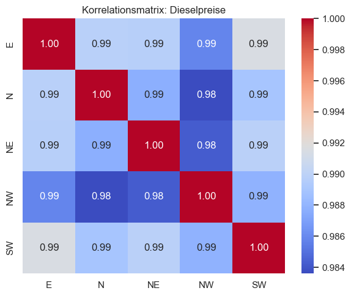
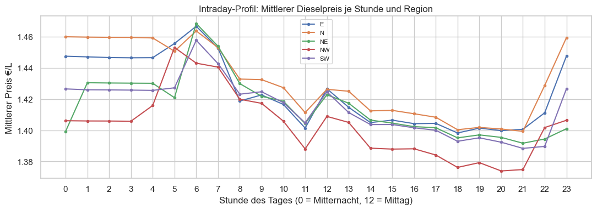
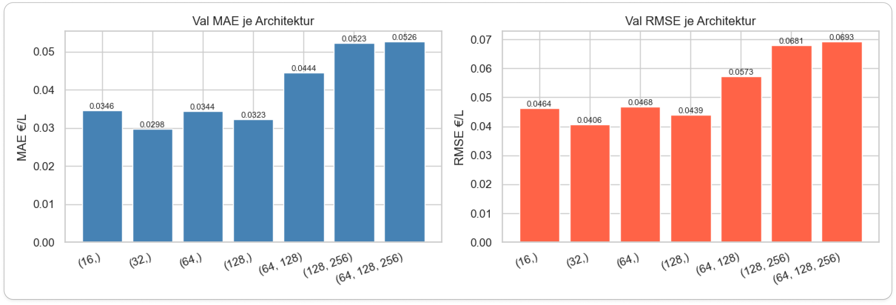
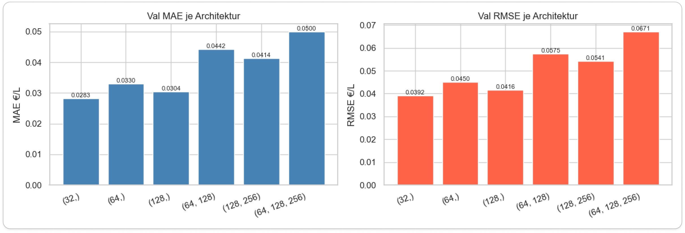
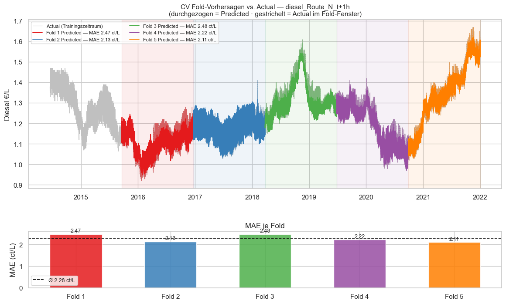
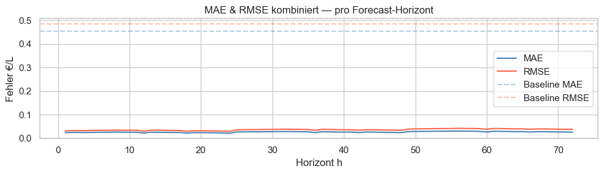
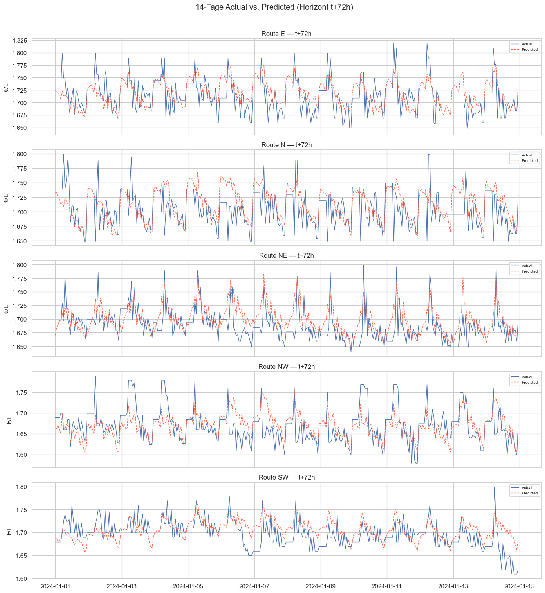
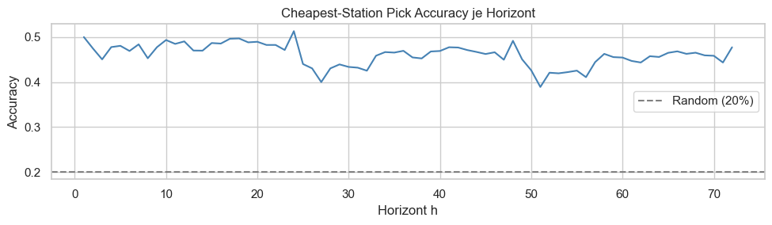

# Handout — Spritpreisanalyse mit Multi-Layer Perceptron
## Hochschule Aalen | Modul Predictive Analytics | Semester 1

> **Quellcode:** 

[`notebooks/spedition_mlp.ipynb`][nb] 

[`scripts/data_transform_spedition.py`][dts] 

[`scripts/model_utils.py`][mu] 

[`scripts/viz_utils.py`][vu]


[nb]:  ../notebooks/spedition_mlp.ipynb
[dts]: ../scripts/data_transform_spedition.py
[mu]:  ../scripts/model_utils.py
[vu]:  ../scripts/viz_utils.py

---

## Inhaltsverzeichnis

- [1 · Business Understanding](#1--business-understanding--unternehmenskontext)
  - [Betriebswirtschaftliche Fragestellung](#betriebswirtschaftliche-fragestellung)
  - [Einsparpotenzial](#einsparpotenzial)
  - [ML-Problemtyp und Erfolgskriterien](#ml-problemtyp-und-erfolgskriterien)
- [2 · Data Understanding](#2--data-understanding--datenverständnis)
  - [Datenquelle und Struktur](#datenquelle)
  - [Stationsauswahl](#stationsauswahl)
  - [Explorative Datenanalyse](#explorative-datenanalyse)
- [3 · Data Preparation](#3--data-preparation--datenvorbereitung)
  - [Verarbeitungspipeline](#verarbeitungspipeline)
  - [Feature Engineering](#feature-engineering)
  - [Zeitlicher Datensplit](#zeitlicher-datensplit)
  - [Normierung und Zielvariable](#normierung)
- [4 · Modeling](#4--modeling--modellierung)
  - [Algorithmus: MLP erklärt](#algorithmus-multi-layer-perceptron-mlp)
  - [Hyperparameter des finalen Modells](#hyperparameter-des-finalen-modells)
  - [Architektur-Vergleich](#architektur-vergleich)
  - [Cross-Validation](#cross-validation-timesseriessplit)
- [5 · Evaluation](#5--evaluation--bewertung-der-ergebnisse)
  - [Metriken einfach erklärt](#metriken--einfach-erklärt)
  - [Testergebnisse](#testergebnisse)
  - [Kritische Interpretation](#kritische-interpretation-der-ergebnisse)
  - [Kosten-Impact-Simulation](#kosten-impact-simulation)
- [6 · Deployment](#6--deployment--praktischer-einsatz)
  - [Dispatch-Empfehlung](#dispatch-empfehlung)
- [7 · Reflexion](#7--reflexion)
  - [Kurskorrektur — warum der ursprüngliche Business Case verworfen wurde](#kurskorrektur-im-projektverlauf--warum-der-ursprüngliche-business-case-verworfen-wurde)
  - [Stärken des Projekts](#stärken-des-projekts)
  - [Grenzen und mögliche Verbesserungen](#grenzen-und-mögliche-verbesserungen)
- [Anhang: Projektstruktur](#anhang-projektstruktur)

---

## 1 · Business Understanding — Unternehmenskontext

### Rolle im Unternehmen

Ein Speditionsunternehmen betreibt 25 LKWs auf fünf Festrouten, die jeweils rund 100 km von Aalen entfernt starten. Die Disposition verantwortet die Kraftstoffkosten als einen der größten variablen Kostenpositionen im Betrieb.

**Relevante Kennzahlen:**

| Parameter | Wert |
|---|---|
| Anzahl LKWs | 25 |
| Max. Tankkapazität | 1.200 L (40-Tonner) |
| Tagesfahrleistung | max. 500 km/Tag (gesetzliches Limit) |
| Kraftstoffverbrauch | 30 L/100 km (beladen) |
| **Tagesverbrauch je LKW** | **150 L/Tag** (500 km × 30 L/100 km) |
| **Tagesverbrauch Flotte** | **3.750 L/Tag** (25 × 150 L) |
| Routen | N, NE, E, SW, NW — je eine Station |
| Forecast-Horizont | 72 Stunden |

### Betriebswirtschaftliche Fragestellung

> **„An welcher unserer fünf Tankstationen ist Diesel in den nächsten 72 Stunden am günstigsten — und welchen LKW sollten wir dorthin schicken?"**

### Einsparpotenzial

Ein LKW legt täglich maximal 500 km zurück und verbraucht bei 30 L/100 km genau **150 Liter Diesel** — mehr kann er an einem Tag nicht nachtanken, unabhängig von der Tankgröße. Für die gesamte Flotte ergibt das **3.750 L/Tag** als realistisches Tagesvolumen.

| Preisvorteil durch opt. Routing | Berechnung | Ersparnis/Tag | Ersparnis/Jahr |
|---|---|---|---|
| 1 ct/L | 0,01 €/L × 3.750 L | **37,50 €** | **9.375 €** |
| 2 ct/L | 0,02 €/L × 3.750 L | **75,00 €** | **18.750 €** |
| 5 ct/L | 0,05 €/L × 3.750 L | **187,50 €** | **46.875 €** |

*(250 Arbeitstage; setzt voraus, dass jeder LKW täglich an der modellgestützt gewählten Station tankt)*

**Optimierungsstrategie:** Das Modell sagt vorher, welche der fünf Stationen in den nächsten 72 h am günstigsten ist. Der Disponent plant den Rückkehrtank der LKWs entlang dieser Preisprognose — und priorisiert Routen, deren Station in den nächsten Stunden besonders günstig ist.

### Hinweis: Überarbeiteter Business Case

Der vorliegende Ansatz ist das Ergebnis einer **Kurskorrektur** im Projektverlauf. Der ursprüngliche Ansatz (B29-Korridor, regionale Clustervorhersage) wurde nach kritischer Prüfung verworfen. Die Gründe sind in [Abschnitt 7](#7--reflexion) erläutert.

### ML-Problemtyp und Erfolgskriterien

Das Problem ist eine **Zeitreihen-Regression**: Aus historischen Preis- und Zeitmerkmalen sollen zukünftige Preise vorhergesagt werden.

| Kriterium | Ziel |
|---|---|
| **Cheapest-Station Pick Accuracy** | Wie oft wird die tatsächlich günstigste Station korrekt identifiziert? Zufalls-Baseline: **20 %** (1 von 5) |
| **Spearman-Rangkorrelation** |  Misst, wie gut zwei Rangreihen (alle Staionen) übereinstimmen |
| **MAE (Mean Absolute Error)** | Mittlere Preisabweichung in €/L — möglichst klein |
| **R²** | Anteil der erklärten Preisvarianz — möglichst nah an 1 |

---

## 2 · Data Understanding — Datenverständnis

### Datenquelle

Die Datenbasis stammt aus dem **Tankerkönig Open Data**-Projekt: tägliche CSV-Dateien mit den Preisänderungen aller deutschen Tankstellen seit 2014. Der Gesamtdatensatz umfasst:

- **~87 GB** historische CSV-Dateien 
- **1,1 Milliarden** Preiseinträge über **4.365 Tage (2014 – 2026)**
- **> 15.000 Tankstellen** deutschlandweit

#### Datenstruktur Tankerkönig
```
tankerkoenig-data
├── prices
│   ├── 2014
│   │   ├── 06
│   │   ├── 07
│   │   ├── ...
│   │   └── 12
│   ├── 2015
│       ├── 01
│       ├── 02
│       ├── ...
│
└── stations
    ├── 2019
    │   ├── 01
    │   ├── 02
    │   ├── ...
    │   └── 12
    ├── 2020
    │   ├── 01
    │   ├── 02
    │   ├── ...

257 directories
```

#### Struktur stations.csv

```
uuid,name,brand,street,house_number,post_code,city,latitude,longitude
00060723-0001-4444-8888-acdc00000001,BAGeno Raiffeisen eG,"",Künzelsauer Strasse,7,74653,Ingelfingen ,49.296821594238,9.6613845825195
005056ba-7cb6-1ed2-bceb-5332ab168d12,famila Tankstelle,FAMILA,Pascalstrasse,9,25442,Quickborn,53.74215,9.94124
005056ba-7cb6-1ed2-bceb-573c18314d16,star Tankstelle,STAR,Riehler Strasse,240,50735,Köln,50.9618,6.98007
```

#### Struktur prices.csv

```
date,station_uuid,diesel,e5,e10,dieselchange,e5change,e10change
2025-07-08 00:01:49+02,b78ace98-5bde-4f84-9820-8abd807e9644,1.689,1.829,1.769,1,1,1
2025-07-08 00:01:49+02,83fca0be-3266-4e37-a510-c5bf78ad3848,1.578,1.669,1.619,1,0,0
2025-07-08 00:01:49+02,701c43a9-3ad4-4921-a1ba-14e773301689,1.648,1.788,1.738,0,1,1
```

### Stationsauswahl

Für jede der fünf Himmelsrichtungen (N, NE, E, SW, NW) wird aus dem Ring **80 – 120 km um Aalen** die Station mit der höchsten Datenverfügbarkeit ausgewählt. Aus **1.233 Kandidaten** werden fünf Stationen ausgewählt:

| Route | Marke | Ort | Entfernung | Preis-Ereignisse |
|---|---|---|---|---|
| **N** | AVIA | Ipsheim | 81 km | 131.857 |
| **NE** | AVIA | Nürnberg | 98 km | 111.210 |
| **E** | ESSO | Olching | 114 km | 102.641 |
| **NW** | AVIA | Mühlhausen | 109 km | 128.574 |
| **SW** | RAN | Biberach | 86 km | 111.145 |

Die Auswahl erfolgt automatisiert über **Haversine-Distanz** und Kompasswinkel. Der Code ist im Notebook ([`§ 2 — Data Understanding`][nb]) vollständig dokumentiert. Pro Sektor wird die Station mit den meisten historischen Preisereignissen gewählt.

**Haversine-Formel — Großkreisabstand auf der Kugeloberfläche**

Die Euklidische Distanz auf Koordinaten liefert für geographische Abstände systematisch falsche Ergebnisse, weil Längengrade zum Äquator hin konvergieren. Die Haversine-Formel leitet sich aus der sphärischen Trigonometrie ab und berechnet den **Großkreisabstand**, also die kürzeste Verbindung zweier Punkte auf einer Kugeloberfläche. Der Begriff *Haversine* geht auf Inman (1835) zurück [11].


### Explorative Datenanalyse

Drei Beobachtungen aus der EDA sind für das Modell relevant:

1. **Hohe Korrelation zwischen allen Stationen** (r > 0,95): Der Rohölpreis treibt alle Preise gemeinsam. Lokale Unterschiede sind gering, aber vorhersagbar.



2. **Intraday-Muster**: Preise steigen typischerweise morgens und fallen abends. Dieses Muster wiederholt sich täglich und ist ein wertvolles Signal für das Modell.



3. **Fehlende Stunden**: Tankstellen melden Preise nur bei Änderungen. Stunden ohne Meldung werden per **Vorwärtsfüllung** (letzter bekannter Preis) aufgefüllt.

---

## 3 · Data Preparation — Datenvorbereitung

### Verarbeitungspipeline

Die gesamte Vorbereitung ist in der Klasse [`SpeditionDataLoader`][dts] gekapselt:


```
87 GB CSV-Dateien (parallel einlesen und filtern)
        ↓
  Filterung auf 5 Stations-UUIDs
        ↓
  Stündliche Aggregation je Station
        ↓
  Vorwärtsfüllung fehlender Stunden
        ↓
  Feature Engineering (101 Features)
        ↓
  Normierung (StandardScaler)
        ↓
  Zeitlicher Split: Train | Val | Test
```


Das parallele CSV-Einlesen (via `ThreadPoolExecutor`) reduziert die Ladezeit erheblich. Ein **Parquet-Cache** verhindert, dass der 87-GB-Scan bei jeder Notebook-Ausführung wiederholt werden muss.

### Feature Engineering

Pro Zeitschritt und Station werden folgende Merkmale berechnet. Somit ergeben sich insgesamt **101 Input-Features** für das Modell:

| Feature-Gruppe | Beschreibung |
|---|---|
| **Lag-Features** | Historische Preise zu den Zeitpunkten t−1h, −2h, −3h, −6h, −12h, −24h, −48h, −72h, −168h |
| **Gleitender Mittelwert** | Durchschnittspreis der letzten 6h, 24h, 48h |
| **Gleitende Standardabweichung** | Preisschwankung der letzten 6h, 24h, 48h |
| **Trend** | Lineare Steigung der letzten 24h (steigt oder fällt der Preis?) |
| **Momentum** | Preisänderung zwischen t und t−24h |
| **Preis t** | Aktueller Preis zum Beobachtungszeitpunkt |
| **Differenz** | Preisänderung zwischen t und t−1h |
| **Zyklische Zeit** | Stunde und Wochentag als Sinus/Kosinus kodiert |
| **Kalender** | Binär: Wochenende ja/nein, Feiertag ja/nein |


> **Warum Sinus/Kosinus statt Stundenzahl?**  
> Als reine Zahl liegen Stunde 23 und Stunde 0 weit auseinander (23 und 0), obwohl sie zeitlich direkt aufeinander folgen. Die Sinus/Kosinus-Kodierung macht diesen Übergang „glatt" — das Modell sieht keinen künstlichen Sprung über Mitternacht hinweg. Das gleiche Prinzip gilt für den Wochentag.

### Zeitlicher Datensplit

**Wichtig:** Zeitreihendaten dürfen nicht zufällig durchmischt werden. Das Modell würde sonst „in die Zukunft schauen" und unrealistisch gute Ergebnisse erzielen. Stattdessen wird strikt chronologisch aufgeteilt:

| Datensatz | Zeitraum | Einträge |
|---|---|---|
| **Training** | Jun 2014 – Dez 2021 | 66.159 |
| **Validierung** | Jan 2022 – Dez 2023 | 17.520 |
| **Test** | Jan 2024 – heute | 20.829 |
| **Gesamt** | |104.508 |


### Normierung

Alle Features werden mit dem **StandardScaler** [7] auf Mittelwert 0 und Standardabweichung 1 normiert — damit kein Merkmal allein durch seine Größenordnung das Training dominiert. Kritisch: Der Scaler wird **ausschließlich auf den Trainingsdaten** angepasst (`fit`) und dann auf Validierung und Test nur angewendet (`transform`). Würde man den Scaler auf allen Daten anpassen, flössen Zukunftsinformationen ins Training und es würde zum **Datenleck** kommen.

### Ziel-Features

Pro Zeitschritt sagt das Modell gleichzeitig **5 Stationen × 72 Zeithorizonte = 360 Ausgabewerte** vorher (Multi-Output-Regression). Das Ziel-DataFrame `y` hat also 360 Spalten.

---

## 4 · Modeling — Modellierung

### Algorithmus: Multi-Layer Perceptron (MLP)

Ein MLP bildet nichtlineare Zusammenhänge zwischen Eingangsgrößen und Zielgrößen ab. Es besteht aus mehreren Schichten von Neuronen, die über gewichtete Verbindungen gekoppelt sind. Das Konzept des Neurons geht auf Rosenblatt (1958) [1] zurück; die moderne Formulierung mehrschichtiger Netze und des Backpropagation-Algorithmus wurde von Rumelhart, Hinton & Williams (1986) [2] geprägt. Eine umfassende Darstellung findet sich in Goodfellow, Bengio & Courville (2016) [5].

**Struktur — und Belegung im Projekt:**

| Schicht | Allgemein | Im Projekt |
|---------|-----------|------------|
| Eingabeschicht | nimmt Features auf | 101 Features (Lag, Kalender, Trend) |
| Versteckte Schicht(en) | extrahieren Muster | 1 Schicht, 32 Neuronen |
| Ausgabeschicht | liefert Vorhersage | 360 Werte (5 Stationen × 72 Horizonte) |

**Das Neuron**

Jedes Neuron berechnet eine gewichtete Summe seiner Eingaben, addiert einen Bias und wendet eine Aktivierungsfunktion an:

a = f( w₁x₁ + w₂x₂ + … + b )

| Parameter | Eigenschaft | Bedeutung |
|-----------|-------------|-----------|
| wᵢ | lernbar | Wie stark beeinflusst Eingang i das Neuron? |
| b | lernbar | Verschiebt die Aktivierungsschwelle vom Ursprung |
| f(·) | fix (z. B. ReLU) | Führt Nichtlinearität ein |

> Ohne Aktivierungsfunktion ist ein beliebig tiefes Netz mathematisch äquivalent zu einer einzigen linearen Transformation.

**Training: Die vier Schritte**

| Schritt | Bezeichnung | Beschreibung |
|---------|-------------|--------------|
| 1 | Forward Pass | Eingabe wird schichtweise verarbeitet → Vorhersage ŷ |
| 2 | Loss | Verlustfunktion misst Abweichung: L = (y − ŷ)² |
| 3 | Backpropagation | Kettenregel bestimmt, wie stark jedes Gewicht zum Fehler beigetragen hat: ∂L/∂wᵢⱼ [2] |
| 4 | Gewichtsupdate | w ← w − η · ∂L/∂w |

> **Lernrate η:** Zu groß → Divergenz. Zu klein → langsame Konvergenz.
> In der Praxis: Mini-Batch-Gradientenabstieg (16–256 Beispiele pro Update).

**Aktivierungsfunktion**

Eine Aktivierungsfunktion wird nach der gewichteten Summe eines Neurons angewendet und entscheidet, welches Signal an die nächste Schicht weitergegeben wird. Ohne sie wäre ein beliebig tiefes Netz mathematisch äquivalent zu einer einzigen linearen Transformation — die Schichten könnten keine nichtlinearen Muster lernen.

Dieses Projekt verwendet **ReLU** (*Rectified Linear Unit*): f(z) = max(0, z) — negative Werte werden auf 0 gesetzt, positive unverändert weitergegeben [3].

ReLU wird gegenüber älteren Funktionen wie Sigmoid bevorzugt, weil ihr Gradient für z > 0 konstant 1 bleibt. Bei Sigmoid geht der Gradient für große |z| gegen 0 — das Fehlersignal stirbt beim Rückpropagieren durch mehrere Schichten aus (*Vanishing Gradient* [4]). ReLU vermeidet diesen Effekt und trainiert dadurch stabiler.

**Overfitting**

| Signal | Bedeutung |
|--------|-----------|
| Trainingsfehler ↓, Validierungsfehler ↑ | Overfitting — Modell hat Trainingsdaten auswendig gelernt |
| Beide Fehler hoch | Underfitting — Modell zu einfach für das Problem |

Gegenmaßnahmen: **Dropout** [6], **L2-Regularisierung**, **Early Stopping**.

**Warum MLP für dieses Problem?**

| Eigenschaft | Vorteil für dieses Projekt |
|---|---|
| **Multi-Output** | Ein Modell sagt alle 5 Stationen × 72 Horizonte gleichzeitig vorher |
| **Nichtlinear** | Erfasst komplexe Muster: Preissprünge, Wochentag-Effekte, Saisonalität |
| **Skalierbar** | Architektur (Anzahl und Größe der Schichten) ist anpassbar |
| **Weit verbreitet** | Gut dokumentiert, in scikit-learn integriert, reproduzierbar |

**Grenzen des Algorithmus:**

- Benötigt viele Trainingsdaten — bei wenigen Daten schlechter als einfache Modelle
- Keine direkte Erklärung, *warum* eine Vorhersage entsteht (Black Box)
- Hyperparameter-Tuning nötig: falsch gewählte Schichtgröße → schlechtere Ergebnisse
- Externe Einflüsse (Rohölpreis, Steuerpolitik) nicht automatisch integriert

### Hyperparameter des finalen Modells

| Parameter | Wert | Bedeutung |
|---|---|---|
| `hidden_layer_sizes` | `(32,)` | 1 versteckte Schicht mit 32 Neuronen |
| `max_iter` | 2000 | Maximale Anzahl Trainingsdurchläufe |
| `early_stopping` | `True` | Stoppt, wenn die Fehler auf dem Validierungsanteil nicht mehr sinken |
| `n_iter_no_change` | 100 | Wartet 100 Iterationen ohne Verbesserung, bevor abgebrochen wird |
| `learning_rate` | `adaptive` | Lernrate passt sich automatisch an |
| `random_state` | 42 | Reproduzierbarkeit: gleiche Parameter → gleiche Ergebnisse |

### Baseline

Als Untergrenze dient ein **DummyRegressor** (gibt immer den Trainings-Durchschnittspreis aus, ohne auf aktuelle Daten zu schauen):

- Baseline MAE: **0,454 €/L** — das ist der Referenzwert, der geschlagen werden muss

### Architektur-Vergleich

Sieben Netzwerkgrößen wurden in zwei Experimenten auf dem Validierungsdatensatz verglichen — einmal mit geduldigen Trainingsparametern (`tol=1e-5`, `n_iter_no_change=100`), einmal mit Standardparametern (`n_iter_no_change=50`, `max_iter=1000`):

**Experiment 1 — geduldige Parameter**

| Architektur | MAE (€/L) | RMSE (€/L) | Iterationen | Parameter |
|---|---|---|---|---|
| **(32,)** ← gewählt | **0,02975** | **0,04061** | 1.088 | 15.144 |
| (128,) | 0,03227 | 0,04388 | 768 | 59.496 |
| (64,) | 0,03445 | 0,04680 | 899 | 29.928 |
| (16,) | 0,03457 | 0,04639 | 579 | 7.752 |
| (64, 128) | 0,04440 | 0,05731 | 1.088 | 61.288 |
| (128, 256) | 0,05227 | 0,06809 | 1.056 | 138.600 |
| (64, 128, 256) | 0,05263 | 0,06929 | 944 | 140.392 |



**Experiment 2 — Standardparameter**

| Architektur | MAE (€/L) | RMSE (€/L) | Iterationen | Parameter |
|---|---|---|---|---|
| **(32,)** ← gewählt | **0,02829** | **0,03921** | 91 | 15.144 |
| (128,) | 0,03044 | 0,04158 | 158 | 59.496 |
| (64,) | 0,03304 | 0,04499 | 196 | 29.928 |
| (64, 128) | 0,04423 | 0,05755 | 192 | 61.288 |
| (128, 256) | 0,04137 | 0,05409 | 204 | 138.600 |
| (64, 128, 256) | 0,04999 | 0,06708 | 305 | 140.392 |



**Wichtige Beobachtungen:**

- `(32,)` gewinnt in beiden Experimenten — ein flaches, schmales Netz reicht für dieses Problem aus
- Tiefere Netze (`(64,128)`, `(128,256)`) schneiden trotz deutlich mehr Parametern *schlechter* ab — ein Hinweis auf Overfitting
- Die Standard-Parameter liefern sogar leicht bessere Werte als die geduldigen Parameter (MAE 0,02829 vs. 0,02975), bei einem Bruchteil der Trainingszeit (91 vs. 1.088 Iterationen)
- Es wurde keine ausführliche Hyperparameter-Studie durchgeführt. Daher ist es möglich, dass noch bessere Konfigurationen existieren.

### Cross-Validation (TimeSeriesSplit)

Um die Architekturwahl abzusichern, wird ein **TimeSeriesSplit** mit 5 Folds auf den Trainingsdaten (Jun 2014 – Dez 2021) durchgeführt.

**Warum kein klassisches k-Fold?**

Beim Standard-k-Fold werden die Daten zufällig in Blöcke aufgeteilt — ein Modell könnte dann auf Daten von Oktober 2020 trainieren und auf Daten von März 2018 validieren, also faktisch *in die Vergangenheit schauen*. Bei Zeitreihen ist das ein Datenleck: das Modell hätte Zugriff auf spätere Preismuster, die zum Validierungszeitpunkt noch unbekannt waren. TimeSeriesSplit erzwingt die kausale Richtung: das Modell lernt immer auf einem früheren Zeitraum und wird auf einem späteren getestet. Hyndman & Athanasopoulos (2021) [8] bezeichnen dieses Vorgehen als *Time Series Cross-Validation* und empfehlen es als Standardverfahren für Zeitreihenprobleme.

```
Fold 1: [──Train (≈13.000 h)──][Val (≈10.700 h)]
Fold 2: [──────Train (≈24.000 h)──────][Val (≈10.700 h)]
Fold 3: [────────────Train (≈35.000 h)────────────][Val (≈10.700 h)]
Fold 4: [──────────────────Train (≈46.000 h)──────────────────][Val (≈10.700 h)]
Fold 5: [────────────────────────Train (≈55.000 h)────────────────────────][Val (≈10.700 h)]
```

**Ergebnisse der 5 Folds (Architektur `(32,)`):**

| Fold | MAE (ct/L) | RMSE (ct/L) | R² | Iterationen |
|---|---|---|---|---|
| Fold 1 | 2,468 | 3,326 | 0,781 | 676 |
| Fold 2 | 2,128 | 2,884 | 0,712 | 891 |
| Fold 3 | 2,479 | 3,200 | 0,854 | 358 |
| Fold 4 | 2,222 | 2,920 | 0,923 | 535 |
| Fold 5 | 2,105 | 2,764 | 0,970 | 563 |
| **Ø** | **2,280 ± 0,162** | **3,019 ± 0,210** | **0,848 ± 0,094** | |



**Analyse der Fold-Ergebnisse:**

Auf den ersten Blick erscheint der Anstieg von R² über die Folds (0,78 → 0,71 → 0,85 → 0,92 → 0,97) fast wie ein Trend. Tatsächlich überlagern sich drei Effekte:

1. **Mehr Trainingsdaten in späteren Folds** — Fold 1 trainiert auf ~13.000 Stunden, Fold 5 auf ~55.000. Je mehr historische Stunden verfügbar sind, desto stabiler werden die Schätzungen für Tages- und Wochenrhythmen.

2. **Nicht-Stationarität des Datensatzes** — Preisregime ändern sich über ein Jahrzehnt erheblich. Das Modell wird auf einem frühen Zeitabschnitt trainiert und auf einem anderen validiert — die Features (z. B. gleitende Mittelwerte) sind auf das gelernte Preisniveau kalibriert. Validiert man auf einem Zeitraum mit einem anderen Preisniveau oder anderer Volatilität, steigt der Fehler systematisch.

3. **Nicht-Monotonie zwischen Fold 1 und Fold 2** — Fold 2 hat *mehr* Trainingsdaten als Fold 1, aber ein niedrigeres R² (0,700 vs. 0,778). Das ist kein Widerspruch: Der Validierungszeitraum von Fold 2 fällt in einen anderen Marktabschnitt als Fold 1 — offenbar einen, der schwerer vorherzusagen war. Zeitreihen-CV misst immer beides: Modellkapazität *und* inhärente Vorhersagbarkeit des validierten Zeitraums.

Die R²-Streuung von σ = 0,094 ist beträchtlich. Ein Modell, das auf dem gesamten Trainings­datensatz mit R² ≈ 0,95 abschneidet, zeigt in der CV-Analyse Fold-R²-Werte zwischen 0,71 und 0,97 — ein klarer Hinweis auf **temporale Nicht-Stationarität**: Der Dieselmarkt ist in manchen Perioden strukturell leichter vorherzusagen als in anderen. Das ist keine Modellschwäche, sondern eine Eigenschaft des Marktes.

Der CV-Lauf nutzt dieselbe Architektur `(32,)` wie das finale Modell — die CV-Ergebnisse sind damit ein direkter Stabilitätsnachweis der gewählten Konfiguration.

---

## 5 · Evaluation — Bewertung der Ergebnisse

### Metriken — einfach erklärt

**MAE (Mean Absolute Error) — Wie weit daneben im Schnitt?**

Stell dir vor, du tippst jeden Tag den Dieselpreis. Der MAE sagt dir: „Im Durchschnitt liegst du X Cent pro Liter daneben." Kleiner ist besser. 0 wäre perfekt — kommt in der Praxis nicht vor.

**RMSE (Root Mean Squared Error) — Wie schlimm sind die größten Fehler?**

Wie der MAE, aber besonders große Fehlvorhersagen werden doppelt bestraft — wie ein Lehrer, der grobe Fehler stärker bewertet als kleine. Ein RMSE deutlich größer als der MAE zeigt: es gibt einzelne Stunden mit besonders starken Abweichungen.

**R² (Bestimmtheitsmaß) — Wie viel der Preisschwankungen erklärt das Modell?**

0,0 = das Modell ist so gut wie pures Raten. 1,0 = das Modell erklärt alle Preisbewegungen perfekt. Werte nahe 1 zeigen: das Modell hat Muster wirklich verstanden, nicht nur auswendig gelernt.

**Cheapest-Station Pick Accuracy — Trifft das Modell die richtige Station?**

Die zentrale Kennzahl des Projekts: Wie oft wählt das Modell die Station mit dem tatsächlich günstigsten Preis?

- **Zufalls-Baseline:** 1 von 5 = **20 %**
- Ein Modell über dieser Grenze leistet echten Mehrwert für die Disposition

**Spearman-Rangkorrelation ρₛ — Stimmt die Reihenfolge der Stationen?**

Neben der reinen Preisabweichung wird gemessen, ob die **Reihenfolge** der Stationen (von günstigst bis teuerst) korrekt vorhergesagt wird — denn für die Dispatch-Entscheidung zählt das Ranking, nicht der exakte Centbetrag.

Der **Spearman-Rangkorrelationskoeffizient** ρₛ [9] misst, wie gut zwei Rangreihen übereinstimmen. Hier wird für jeden Zeitschritt die vorhergesagte Preisreihenfolge der fünf Stationen mit der tatsächlichen verglichen. 
| ρₛ | Interpretation |
|---|---|
| **1,0** | Stationsreihenfolge wird jederzeit perfekt vorhergesagt |
| **≥ 0,8** | Sehr gutes Ranking — praktisch brauchbar |
| **≈ 0,5** | Schwaches Signal — Reihenfolge teilweise korrekt |
| **≈ 0,0** | Kein Zusammenhang — Modell schlechter als Zufall beim Ranking |
| **< 0** | Systematische Umkehrung der Reihenfolge |

### Testergebnisse

Der Testdatensatz umfasst **20.829 Einträge** (Jan 2024 – Mai 2026) — Daten, die das Modell während des Trainings nie gesehen hat.

| Metrik | Baseline (Dummy) | MLP Validation (32,) | MLP **Test (32,)** |
|---|---|---|---|
| MAE | 0,454 €/L | 0,030 €/L | **0,026 €/L** |
| RMSE | 0,485 €/L | 0,041 €/L | **0,036 €/L** |
| R² | — | 0,953 | **0,955** |
| Skill Score | — | — | **94,3 %** |
| Pick Accuracy (gesamt) | 20 % | — | **46,0 %** |
| Ø Spearman ρ | — | — | **0,496** |



**Skill Score** gibt an, um wie viel Prozent das Modell besser ist als die triviale Baseline:

$$\text{Skill} = \left(1 - \frac{\text{MAE}_\text{Modell}}{\text{MAE}_\text{Baseline}}\right) \cdot 100 = \left(1 - \frac{0{,}026}{0{,}454}\right) \cdot 100 = 94{,}3\,\%$$

### Kritische Interpretation der Ergebnisse

Das folgende Diagramm zeigt exemplarisch 14 Tage Actual vs. Predicted bei t+72h für alle fünf Routen — dem schwierigsten Vorhersagehorizont. Der Trend wird konsistent getroffen; Preisspitzen (z.B. 07.–08. Jan) werden geglättet statt ausgeschlagen. Das illustriert, warum R² hoch ist, das Stationsranking aber schwächer: Das Modell trifft das Niveau, nicht die feinen Unterschiede zwischen Stationen.



**Zwei Schichten von Ergebnissen: Preisniveau vs. Stationsranking**

Die Metriken des Projekts messen zwei grundsätzlich verschiedene Fähigkeiten des Modells:

- **R² = 0,955 / MAE = 0,026 €/L** messen, wie gut das absolute Preisniveau jeder Station vorhergesagt wird. Das Modell liegt im Schnitt 2,6 Cent pro Liter daneben — bei einem Gesamtpreis von ~1,80 €/L eine relative Abweichung von ~1,4 %.

- **Pick Accuracy 46,0 % / Spearman ρ = 0,496** messen, wie gut die *Reihenfolge* der fünf Stationen vorhergesagt wird. Hier ist das Bild deutlich schwächer.

Diese Divergenz ist inhärent: Wenn alle fünf Stationen im Wesentlichen denselben Trend folgen und sich um wenige Cent unterscheiden, reicht eine kleine absolute Fehlvorhersage schon aus, um die Rangfolge zu vertauschen. Das Modell lernt das gemeinsame Preisniveau sehr gut — die *differenziellen* Abweichungen zwischen Stationen sind deutlich schwerer zu erfassen.

**Paradoxon: Testfehler < Validierungsfehler**

Das Modell macht auf dem Testdatensatz (2024–2026) *geringere* Fehler als auf dem Validierungsdatensatz (2022–2023). Der Validierungszeitraum fällt in die **europäische Energiekrise** infolge des russischen Angriffs auf die Ukraine (Feb 2022). Diesel-Preise stiegen von ~1,55 €/L auf über 2,30 €/L und schwankten außergewöhnlich stark — ein Regime, das im Trainingsdatensatz (2014–2021) kaum vorkommt. Der höhere Validierungsfehler ist damit **kein Zeichen von Overfitting**, sondern ein Abbild echter Marktturbulenzen, auf die das Modell nicht vorbereitet war.

**Pick Accuracy: 46,0 % — mehr als doppelt so hoch wie Zufall, aber nicht dominierend**

Das Modell identifiziert in 46,0 % der Stunden die tatsächlich günstigste Station — gegenüber 20 % bei zufälliger Wahl. Das ist ein messbarer Vorteil, doch bedeutet es gleichzeitig: in **54 % der Fälle** liegt die Modell-Empfehlung daneben. MAE und RMSE steigen erwartungsgemäß mit dem Horizont — interessanter ist, dass die Pick Accuracy das nicht tut:

| Horizont | Pick Accuracy | Bewertung |
|---|---|---|
| t+1h | 50,0 % | gut |
| t+24h | **51,3 %** | **Maximum** — Tagesrhythmus-Muster greifen |
| t+48h | 49,1 % | leicht rückläufig |
| t+72h | 47,7 % | schwächste Stunden, aber noch 2,4× über Zufall |



Das Modell ist bei **t+24h tatsächlich am präzisesten** beim Stationsranking — vermutlich weil es den Tagesrhythmus (Preise steigen morgens, fallen abends) sehr gut gelernt hat und dieser Effekt bei 24h-Vorschau besonders ausgeprägt ist.

**Spearman ρ = 0,496 — schwaches bis moderates Ranking-Signal**

ρ = 0,496 liegt nahe dem Bereich eines „schwachen Signals" (≈ 0,5) aus der Interpretationstabelle in *Metriken — einfach erklärt*. Das Ranking der Stationen wird damit mäßig korrekt vorhergesagt. Dasselbe nicht-monotone Muster zeigt sich auch hier: Maximum bei t+24h (ρ = 0,575), Minimum bei h=51 (ρ = 0,439) — manche Horizonte sind strukturell schwieriger als andere. Von 20.829 Teststunden wurden 20.827 für die Spearman-Berechnung genutzt — nur 2 Stunden wurden wegen konstanter Preisvektoren ausgeschlossen.

**Generalisierung ist gegeben**

Das Modell wurde auf Daten bis Ende 2021 trainiert und erzielt auf Daten aus 2024–2026 R² = 0,955. Das Preisniveau 2024 (~1,80 €/L) liegt nahe dem Trainingsdurchschnitt; die Muster (Tagesgang, Wochentag, Momentum) haben sich nicht wesentlich verändert. Die hohe Skill Score (94,3 %) zeigt, dass das Modell generalisierbare Strukturen gelernt hat und nicht die Preisniveaus eines spezifischen Zeitraums auswendig kennt.

### Kosten-Impact-Simulation

Die Simulation quantifiziert den betriebswirtschaftlichen Vorteil des Modells auf dem Testdatensatz.

Basis: realistisches Tagesvolumen der Flotte (25 LKWs × 150 L/Tag = 3.750 L). Ein LKW verbraucht max. 150 L/Tag — die 1.200-L-Tankkapazität ist keine sinnvolle Rechenbasis, da kein LKW täglich seinen vollen Tank leert.

| Szenario | Berechnung | Mehrkosten/Tag |
|---|---|---|
| Zufall (Baseline) | 7,93 ct × 80 % Miss-Rate × 3.750 L Flottenvolumen | **237,90 €** |
| MLP-Routing | 7,93 ct × 54,0 % Miss-Rate × 3.750 L Flottenvolumen | **160,73 €** |
| **Einsparung vs. Zufall** | | **77,17 €/Tag ≈ 19.300 €/Jahr** |

Der durchschnittliche Preisspread zwischen der günstigsten und teuersten Station beträgt **7,93 ct/L** — deutlich mehr als die 1-ct/L-Annahme aus Abschnitt 1. Das liegt daran, dass hier der Mittelwert über alle 72 Horizonte und alle 20.829 Stunden eingeht, also auch Zeitfenster mit ungewöhnlich hoher Preisspreizung.

**Kritische Einschränkungen:**
1. Der Spread von 7,93 ct/L ist ein Durchschnitt über alle Horizonte; für kurzfristige Entscheidungen (t+1h bis t+8h) ist er realistischer als für 72h-Prognosen.
2. Die Einsparung setzt voraus, dass der Disponent ausschließlich die Modellempfehlung befolgt — in der Praxis spielen Routenplanung und Fahrzeugdisposition ebenfalls eine Rolle.
3. Die Simulation geht von gleichmäßiger Auslastung (500 km/Tag je LKW) aus. An Tagen mit geringer Fahrleistung sinkt das Einsparpotenzial entsprechend.

---

## 6 · Deployment — Praktischer Einsatz

### Dispatch-Empfehlung

Die Funktion `recommend_cheapest_station` (in [`model_utils.py`][mu]) gibt dem Disponenten für einen wählbaren Zeithorizont eine priorisierte Stationsliste aus:

```
┌─ Dispatch Recommendation ────────────────────────────────────────┐
│  Horizont     : +8h                                              │
│  Günstigste   : Route_NE        → €1.901/L                       │
│  Ranking      : NE (1.901) > NW (1.936) > N (1.962) > ...        │
│  Ersparnis vs. teuerste Station: ~€17.25 / LKW-Befüllung (150 L) │
└──────────────────────────────────────────────────────────────────┘
```

Der `spread_eur`-Wert ergibt sich aus: Preisdifferenz (günstigste vs. teuerste Station) × tatsächlicher Tagesverbrauch je LKW (150 L). Er zeigt dem Disponenten den konkreten finanziellen Vorteil für einen einzelnen LKW-Tank.

Mittels **React** ließe sich die Dispatch-Empfehlung als interaktives Dashboard aufbauen: Disponent wählt den Horizont, das Modell zeigt Rangfolge und Preise — direkt im Browser, ohne Python-Kenntnisse.

### Modell speichern und laden

Das fertig trainierte Modell, beide Scaler und die Spalteninformationen werden als `.joblib`-Datei gespeichert. So kann das Modell in Echtzeit neu geladen werden, ohne das Training zu wiederholen — Voraussetzung für einen produktiven Einsatz.

### Mögliche Erweiterung: Nachrichtenabfrage

Eine automatisierte Abfrage von Nachrichtentickern und der mögliche Einfluss dieser Ereignisse auf den Ölpreis und dadurch auf den Kraftstoffpreis wäre ein weiterer denkbarer Schritt. 

---

## 7 · Reflexion

### Kurskorrektur im Projektverlauf — warum der ursprüngliche Business Case verworfen wurde

Der erste Entwurf des Projekts arbeitete mit einem anderen Szenario: Eine Spedition ist auf der **B29 (Aalen → Stuttgart)** unterwegs und soll ihren LKW-Fahrern mitteilen, in welcher **Region** (nicht an welcher konkreten Station) sie tanken sollen. Dafür wurden bis zu 80 Tankstellen in vier geografischen Clustern zu einem regionalen Stundendurchschnitt zusammengefasst und ein MLP auf diesen Clusterdaten trainiert.

Im Projektverlauf wurden zwei grundlegende Probleme erkannt:

**Problem 1 — Kein echter Mehrwert gegenüber bestehenden Lösungen**

LKW-Fahrer können heute über frei verfügbare Apps (z. B. TankerApp, clever-tanken) den aktuellen Preis an jeder nahegelegenen Tankstelle in Echtzeit einsehen. Ein 72-Stunden-Forecast für eine Region liefert keinen Vorteil gegenüber dem Blick in die App kurz vor dem Abbiegen — **Nowcasting wäre ausreichend gewesen**. Das Modell hätte ein Problem gelöst, das in der Praxis nicht existiert.

**Problem 2 — Künstlich einfache Vorhersage durch Mittelwertbildung**

Das Zusammenfassen von bis zu 80 Einzelstationen zu einem Clusterdurchschnitt **glättet den Preis erheblich**: Kurzfristige Schwankungen einzelner Stationen (Preisaktionen, Fehlmeldungen, lokale Wettbewerbs-Reaktionen) verschwinden im Mittel. Das Modell musste dann nur noch langsame Makrotrends erkennen — den Tag-Nacht-Zyklus und den Wochenrhythmus — auf einem Signal, das von Haus aus wenig Rauschen enthält. Die guten Metriken wären kein Zeichen für ein starkes Modell gewesen, sondern ein Artefakt der Datenvorbereitung.

**Die Konsequenz:** Pivot auf das vorliegende Speditionsszenario mit fünf konkreten Einzelstationen. Hier ist der Spread zwischen Stationen real und variabel, Nowcasting ersetzt keine Vorausplanung (der Disponent braucht 72h Vorlauf für die Tourenplanung), und die Vorhersage ist schwieriger — womit gute Metriken tatsächlich etwas bedeuten.

---

### Stärken des Projekts

- **Große, historisch konsistente Datenbasis** (10+ Jahre, stündliche Auflösung)
- **Automatisierte Stationsauswahl** — nachvollziehbar und reproduzierbar per Haversine-Distanz und Datenverfügbarkeit
- **Multi-Output-Ansatz** — ein Modell für alle Stationen und alle 72 Horizonte, kein separates Modell pro Station nötig
- **Kein Datenleck möglich** — Scaler und Split werden konsequent zeitlich korrekt angewendet
- **Vollständig reproduzierbar** — alle Parameter zentral definiert, Caching verhindert doppelte Rechenarbeit

### Grenzen und mögliche Verbesserungen

**Datenqualität — teilweise Ausreißerbehandlung**

Die Pipeline filtert lediglich offensichtlich ungültige Einträge heraus (Preis < 0,50 €/L). Eine statistische Ausreißererkennung — z. B. per oberer Schranke — wurde zwar in einer frühen Explorationsphase untersucht (`data-exploration.ipynb`), aber nicht in die Produktionspipeline übernommen. Vereinzelte Fehlmeldungen (z. B. ein irrtümlich eingetragener Preis von 4,00 €/L statt 1,90 €/L) könnten das Training verzerren. Für die fünf ausgewählten Markenstationen mit je über 100.000 Ereignissen ist das Risiko überschaubar, aber nicht ausgeschlossen.

**Statische Datenbasis — kein dynamisches Nachladen**

Die Pipeline arbeitet ausschließlich auf dem historischen Tankerkönig-Datensatz (Batch-Modus). Ein Live-Zugang zur **Tankerkönig-API** existiert zwar und liefert aktuelle Preise in Echtzeit, ist aber nicht in die Pipeline integriert. Das bedeutet: Das Modell kann aktuell keine tagesaktuellen Preise verarbeiten — eine Vorhersage für „jetzt + 72h" würde manuell ausgelöst werden müssen, nachdem neue Daten manuell heruntergeladen wurden. Für einen produktiven Einsatz wäre ein automatischer stündlicher Datenabruf via API erforderlich.

| Grenze | Verbesserungsansatz |
|---|---|
| Keine statistische Ausreißerbehandlung (nur untere Schranke) | IQR- oder quantilbasierter Filter im `load_raw_prices`-Schritt |
| Statische Datenbasis — kein automatisches Nachladen | Stündlicher Tankerkönig-API-Abruf, Merge in den Cache |
| Externe Preistreiber fehlen (Rohöl, Steuern) | Rohölpreis-API als zusätzliches Feature einbinden |
| Nur 5 feste Stationen | Dynamische Stationsauswahl nach Routenplanung |
| MLP ist eine Black Box | SHAP-Analyse zur Erklärung der Feature-Wichtigkeit |
| Alternativen ungeprüft | Vergleich mit LSTM oder Gradient Boosting (XGBoost) |

### Ausblick

Das Modell ist ein erster, funktionsfähiger Baustein für ein datengetriebenes Fuhrparkmanagementsystem. Kombiniert mit Echtzeitpreisen, Tankstandssensoren und Routenoptimierung entsteht ein vollständiges Kraftstoff-Kostenoptimierungssystem — mit messbarem Einfluss auf die Betriebskosten der Spedition.

---

## Anhang: Projektstruktur

Das Projekt folgt dem **CRISP-DM**-Prozessmodell (Wirth & Hipp, 2000 [10]).

| Datei / Ordner | Aufgabe im Projekt | CRISP-DM-Phase |
|---|---|---|
| [`notebooks/spedition_mlp.ipynb`][nb] | Hauptnotebook — enthält den vollständigen, kommentierten Ablauf von der Fragestellung bis zur Empfehlung | alle Phasen |
| [`scripts/data_transform_spedition.py`][dts] | Klasse `SpeditionDataLoader`: liest CSV-Rohdaten parallel ein, aggregiert auf Stundenwerte, berechnet alle 101 Features, teilt zeitlich auf | Data Preparation |
| `scripts/data_transform.py` | Gemeinsame Konstanten (`LAG_HOURS`, `ROLLING_WINDOWS`, …) und Hilfsfunktionen (`load_config`, Feiertagskalender, Trendberechnung) — von `data_transform_spedition.py` importiert und direkt im Notebook für die Pfadkonfiguration verwendet | Data Preparation |
| [`scripts/model_utils.py`][mu] | Baut und trainiert den MLPRegressor, berechnet MAE/RMSE/R², führt den Architektur-Vergleich durch, erstellt die Dispatch-Empfehlung | Modeling, Evaluation, Deployment |
| [`scripts/viz_utils.py`][vu] | Erstellt alle Diagramme (Zeitreihen, Intraday-Profil, CV-Folds, Actual vs. Predicted, Architektur-Vergleich) | Data Understanding, Evaluation |
| `scripts/geo_utils.py` | Berechnet Haversine-Distanz und Kompasswinkel, weist Himmelsrichtungssektoren zu, wählt die beste Station je Sektor | Data Understanding |
| `data/processed/` | Parquet-Cache der stündlichen Preiszeitreihen — verhindert den wiederholten Scan der 87 GB CSV-Dateien | Data Preparation |
| `data/models/spedition_mlp.joblib` | Gespeichertes Modell inkl. Scaler und Spalteninformationen — ladefähig ohne Neutraining | Deployment |

*HS Aalen — Modul Predictive Analytics, Semester 1*

---

## Literaturverzeichnis

[1] Rosenblatt, F. (1958). The perceptron: A probabilistic model for information storage and organization in the brain. *Psychological Review*, 65(6), 386–408. https://doi.org/10.1037/h0042519

[2] Rumelhart, D. E., Hinton, G. E., & Williams, R. J. (1986). Learning representations by back-propagating errors. *Nature*, 323, 533–536. https://doi.org/10.1038/323533a0

[3] Glorot, X., Bordes, A., & Bengio, Y. (2011). Deep sparse rectifier neural networks. In *Proceedings of the 14th International Conference on Artificial Intelligence and Statistics (AISTATS 2011)*, Fort Lauderdale, 11–13 April 2011, PMLR 15, pp. 315–323. https://proceedings.mlr.press/v15/glorot11a.html

[4] Glorot, X., & Bengio, Y. (2010). Understanding the difficulty of training deep feedforward neural networks. In *Proceedings of the 13th International Conference on Artificial Intelligence and Statistics (AISTATS 2010)*, Sardinia, 13–15 May 2010, PMLR 9, pp. 249–256. https://proceedings.mlr.press/v9/glorot10a.html

[5] Goodfellow, I., Bengio, Y., & Courville, A. (2016). *Deep Learning*. MIT Press. ISBN 978-0-262-03561-3. https://www.deeplearningbook.org

[6] Srivastava, N., Hinton, G., Krizhevsky, A., Sutskever, I., & Salakhutdinov, R. (2014). Dropout: A simple way to prevent neural networks from overfitting. *Journal of Machine Learning Research*, 15(1), 1929–1958. https://www.jmlr.org/papers/v15/srivastava14a.html

[7] Pedregosa, F., Varoquaux, G., Gramfort, A., Michel, V., Thirion, B., Grisel, O., … Duchesnay, E. (2011). Scikit-learn: Machine learning in Python. *Journal of Machine Learning Research*, 12, 2825–2830. https://arxiv.org/abs/1201.0490

[8] Hyndman, R. J., & Athanasopoulos, G. (2021). *Forecasting: Principles and Practice* (3. Aufl.). OTexts. https://otexts.com/fpp3/ (Abschnitt 5.10: Time Series Cross-Validation)

[9] Spearman, C. (1904). The proof and measurement of association between two things. *The American Journal of Psychology*, 15(1), 72–101. http://webspace.ship.edu/pgmarr/Geo441/Readings/Spearman%201904%20-%20The%20Proof%20and%20Measurement%20of%20Association%20between%20Two%20Things.pdf

[10] Wirth, R., & Hipp, J. (2000). CRISP-DM: Towards a standard process model for data mining. In *Proceedings of the 4th International Conference on the Practical Applications of Knowledge Discovery and Data Mining*, Manchester, 11–13 April 2000, pp. 29–40. https://www.semanticscholar.org/paper/CRISP-DM:-Towards-a-Standard-Process-Model-for-Data-Wirth-Hipp/48b9293cfd4297f855867ca278f7069abc6a9c24

[11] Inman, J. (1835). *Navigation and Nautical Astronomy: For the Use of British Seamen* (3. Aufl.). London: W. Woodward, C. & J. Rivington.
